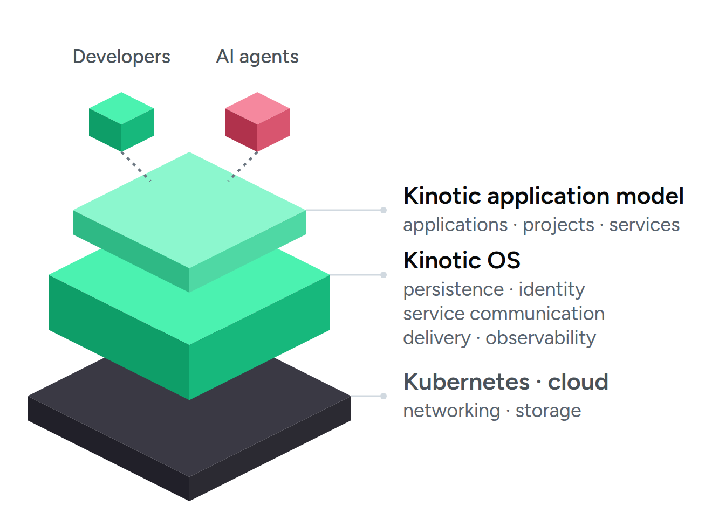
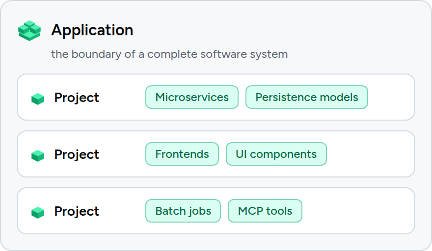
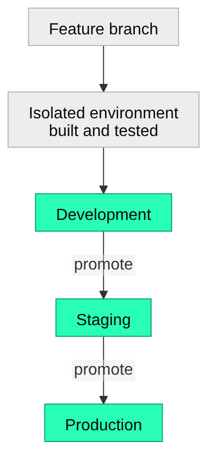
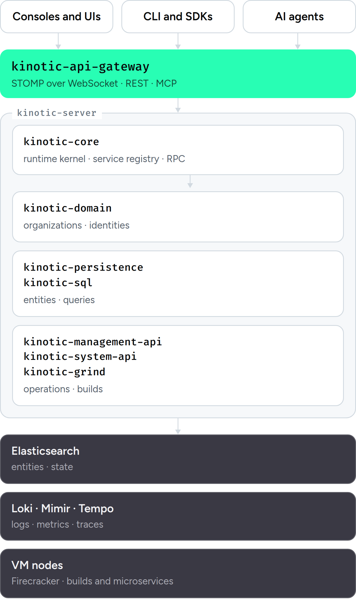
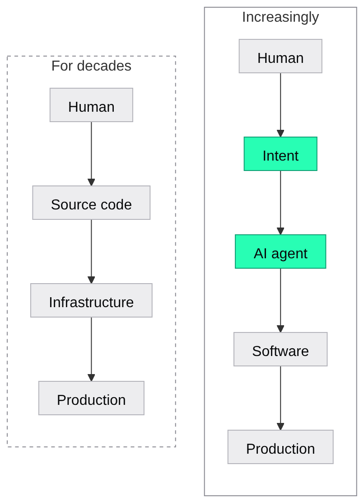

<picture>
  <source media="(prefers-color-scheme: dark)" srcset=".github/assets/kinotic-logo-dark.png">
  
</picture>

### Prototype to production

Linux abstracted the hardware. Kinotic OS abstracts the cloud, 
so humans and AI can build enterprise software at internet scale.

[Website](https://kinotic.ai) · [Documentation](https://kinotic.ai/docs/) · [Get Started](https://kinotic.ai/get-started/) · [Test Reports](https://kinotic.ai/test-results)

AI has dramatically reduced the cost of writing software.

The bottleneck is moving that software from a prototype into a secure, observable, scalable production system.

Kinotic is the application-level operating system that closes that gap.

> **Idea** → 
> **Specification** → 
> **AI-generated application** → 
> **Production**

Kinotic abstracts the complexity of cloud infrastructure so developers and AI agents can build production applications without having to assemble and operate the underlying infrastructure themselves.

---

##  Why Kinotic?

Modern software development has an infrastructure problem.

Creating application code is becoming dramatically easier. AI coding agents can generate services, interfaces, data models, and user interfaces from natural language.

But the production environment underneath that code is still fragmented:

- databases
- APIs
- authentication
- authorization
- service communication
- CI/CD
- environments
- observability
- security
- networking
- scaling
- cloud infrastructure

Developers still have to connect and operate all of these pieces.

Kinotic provides a higher-level abstraction.

Instead of asking developers or AI agents to manipulate infrastructure directly, Kinotic gives them an **application model** from which the platform can manage the underlying production system.

### The goal

**Make production software as easy to create as the prototype.**

---

#  A different abstraction layer

 &nbsp;Cloud providers made infrastructure available on demand.

 &nbsp;Kubernetes made infrastructure orchestration programmable.

 &nbsp;AI coding systems are making software creation nearly free.

 &nbsp;**Kinotic does everything in between.**

<picture>
  <source media="(min-width: 1000px) and (prefers-color-scheme: dark)" srcset=".github/assets/diagrams/abstraction-layer-wide-dark.png" width="560">
  <source media="(min-width: 1000px)" srcset=".github/assets/diagrams/abstraction-layer-wide-light.png" width="560">
  <source media="(prefers-color-scheme: dark)" srcset=".github/assets/diagrams/abstraction-layer-dark.png" width="440">
  
</picture>

Kinotic provides an application-level model that understands:

- applications
- projects
- domain models
- services
- APIs
- permissions
- artifacts
- environments
- deployments
- runtime behavior

This gives both humans and AI agents a constrained, inspectable way to create and operate software.

Rather than giving an AI agent unrestricted access to cloud infrastructure, Kinotic gives it a structured application environment.

That distinction is fundamental to the project.

---

#  From prototype to production

Kinotic is designed around a simple idea:

**The application you prototype should be the application you deploy.**

There should not be a separate "prototype architecture" and "production architecture."

An application can begin with a simple domain model and a few services, then evolve into a production system without requiring a complete rewrite of the underlying infrastructure.

Kinotic provides the capabilities required throughout that lifecycle:

| Lifecycle stage | What Kinotic provides |
|---|---|
| 🛠️&nbsp;**Build** | Application development · Domain models · Persistence · APIs & services · Frontends · MCP tools |
| 🔐&nbsp;**Secure** | Authentication · Fine-grained authorization · Security controls |
| 🚢&nbsp;**Ship** | CI/CD · Preview environments · Staging & production · Kubernetes deployment · Customer-managed infrastructure |
| 📈&nbsp;**Operate** | Observability · LLM observability |

---

#  Built for humans and AI agents

Kinotic treats AI agents as first-class participants in the software development lifecycle.

AI agents need more than access to source code.

They need to understand:

- what an application contains
- what services exist
- what data is available
- what operations are permitted
- how those operations are invoked
- which environments they are operating in
- what the resulting system is doing

Kinotic's declarative application model and service directory provide that context.

The result is a more controlled interface between AI and production infrastructure.

### MCP

Kinotic can expose application capabilities as MCP tools.

This allows applications and their live data to become accessible to AI systems such as Claude, ChatGPT, Cursor, and other MCP-compatible agents.

An agent can work with application capabilities rather than manipulating the underlying infrastructure directly.

---

#  What you can build

Kinotic is designed for applications ranging from small internal tools to production SaaS systems.

|  |  |
|---|---|
| **🧪&nbsp;Micro-SaaS**  Build and deploy a complete application without first assembling a cloud architecture. | **🏢&nbsp;Internal applications**  Replace spreadsheets, scripts, and disconnected tools with governed applications backed by real APIs and data. |
| **🌱&nbsp;Startup applications**  Move from an idea to a production application without building a separate infrastructure platform first. | **🏛️&nbsp;Enterprise applications**  Build applications while retaining control over infrastructure, networking, data, and deployment. |

---

#  Core concepts

Kinotic organizes applications around a small number of fundamental concepts.

<picture>
  <source media="(min-width: 1000px) and (prefers-color-scheme: dark)" srcset=".github/assets/diagrams/core-concepts-wide-dark.png" width="620">
  <source media="(min-width: 1000px)" srcset=".github/assets/diagrams/core-concepts-wide-light.png" width="620">
  <source media="(prefers-color-scheme: dark)" srcset=".github/assets/diagrams/core-concepts-dark.png" width="440">
  
</picture>

## Applications

An **Application** is the logical boundary for a complete software system.

Applications contain the projects and artifacts required to build and operate that system.

## Projects

A **Project** represents a functional part of an application.

Projects can provide different types of artifacts, including services, persistence, frontends, UI components, and jobs.

## Artifacts

Artifacts are the deployable building blocks of an application.

Examples include:

- Microservices
- Persistence models
- Frontends
- UI components
- Batch jobs
- MCP tools

Artifacts can be versioned, resolved, built, and promoted through application environments.

## Domain models

Kinotic provides a declarative model for application data.

From the model, the platform can provide persistence capabilities including:

- repositories
- CRUD operations
- search
- pagination
- named queries

This allows developers to describe the application domain without manually building the entire persistence layer.

## Services

Application services provide executable business capabilities.

Kinotic generates the infrastructure required to expose and communicate with published service operations.

Services can also become discoverable capabilities for AI agents.

---

#  Production capabilities

## Identity and access control

Kinotic provides identity and authorization at multiple levels.

Applications can use:

- OIDC
- organization-level access control
- application-level identities
- machine-to-machine access
- fine-grained authorization

Authorization is designed to be part of the application model rather than something added after the application has been built.

## CI/CD

Kinotic treats deployment as part of the application lifecycle.

Feature branches can receive isolated development environments, allowing changes to be built and tested before promotion.

<picture>
  <source media="(min-width: 1000px) and (prefers-color-scheme: dark)" srcset=".github/assets/diagrams/environments-wide-dark.png" width="620">
  <source media="(min-width: 1000px)" srcset=".github/assets/diagrams/environments-wide-light.png" width="620">
  <source media="(prefers-color-scheme: dark)" srcset=".github/assets/diagrams/environments-dark.png" width="300">
  
</picture>

## Observability

Production applications need to be observable from the moment they are deployed.

Kinotic provides:

- metrics
- logs
- traces
- spans
- application-level visibility
- audit information
- LLM interaction tracing
- token and LLM cost visibility

The objective is simple:

**Don't deploy an application and start figuring out how to observe it afterward.**

---

#  Your cloud or ours

Kinotic can run as a managed platform or inside infrastructure controlled by the customer.

| ☁️&nbsp;**Kinotic OS Cloud** | 🛡️&nbsp;**Customer-managed Kinotic OS** |
|---|---|
| Start building without provisioning or operating the underlying platform. | Forward-deploy Kinotic into your own Kubernetes environment: your cloud, your cluster, your network, your data, your security boundaries. |

The application model remains the same.

This gives organizations a path from managed development to customer-controlled production infrastructure without requiring a completely different platform.

---

#  Architecture

Kinotic is built as an open platform rather than a single monolithic runtime.

<picture>
  <source media="(min-width: 1000px) and (prefers-color-scheme: dark)" srcset=".github/assets/diagrams/architecture-wide-dark.png" width="880">
  <source media="(min-width: 1000px)" srcset=".github/assets/diagrams/architecture-wide-light.png" width="880">
  <source media="(prefers-color-scheme: dark)" srcset=".github/assets/diagrams/architecture-dark.png" width="440">
  
</picture>

The repository contains the major components required to build and operate Kinotic OS.

**JVM platform**

| Module | What it does |
|---|---|
| [`kinotic-core`](kinotic-core) | Runtime kernel: the registry of `@Publish` services, RPC over the clustered event bus, the service directory, the security context, secrets |
| [`kinotic-idl`](kinotic-idl) | Schema model behind the application model: type schemas, decorators, converters, and the `@McpTool` contract |
| [`kinotic-domain`](kinotic-domain) | Platform domain: organizations, participants and identities, security services |
| [`kinotic-persistence`](kinotic-persistence) | Declarative persistence: entity definitions, CRUD repositories, named queries over Elasticsearch |
| [`kinotic-sql`](kinotic-sql) | The SQL grammar used for migrations and named queries, parsed and executed against the entity stores |
| [`kinotic-grind`](kinotic-grind) | Job engine: job and task definitions, runs, progress reporting and events |
| [`kinotic-api-gateway`](kinotic-api-gateway) | Client-facing gateway: STOMP over WebSocket, REST routes, and the MCP endpoint |
| [`kinotic-management-api`](kinotic-management-api) | Management plane: applications, projects, artifacts, deployments, GitHub provisioning, logs and metrics |
| [`kinotic-system-api`](kinotic-system-api) | System plane: workload and VM node orchestration, deployment operations, log and site storage |
| [`kinotic-org-server`](kinotic-org-server) | The org server: the deployable Spring Boot server for the portal, organization members, their machines and the CLI, assembling core, domain, management-api and the gateway |
| [`kinotic-system-server`](kinotic-system-server) | The system server: the deployable Spring Boot server for the system console, the vm-managers and project deployment, assembling core, domain, management-api, system-api and the gateway |
| [`kinotic-migration`](kinotic-migration) | Applies the platform's SQL migrations to the data stores |
| [`kinotic-util`](kinotic-util) | Shared utilities, including the file and bulk file processing workers |
| [`kinotic-test`](kinotic-test) | Java end-to-end test suite, run against a docker-compose cluster |

**TypeScript, UI and operations**

| Component | What it does |
|---|---|
| [`kinotic-js`](kinotic-js) | TypeScript workspace: client SDKs, the `kinotic` CLI, the VM manager, the workload runner, and end-to-end tests |
| [`kinotic-frontend`](kinotic-frontend) | Vue applications: the organization portal, the system console, and their shared components |
| [`deployment`](deployment) | Helm charts, docker-compose stacks, Terraform, KinD, and VM node provisioning |
| [`website`](website) | The documentation site published at [kinotic.ai/docs](https://kinotic.ai/docs/) |

The platform is primarily built around Java 25, Spring Boot, Vert.x, TypeScript, Vue, Bun, Kubernetes, Firecracker, Elasticsearch, Grafana Loki, and OpenTelemetry.

The architecture is intentionally designed so that the application abstraction sits above the underlying infrastructure.

---

#  Open source

Kinotic is an open-source project.

The goal is not to create another opaque application platform where the generated application becomes dependent on a black box.

**Generated code is real code.**

Applications should remain inspectable, understandable, and deployable.

Kinotic provides the higher-level abstractions while allowing developers and organizations to retain visibility into the systems they are building.

See [LICENSE.txt](LICENSE.txt) for the terms governing the project.

---

#  Contributing

Kinotic is actively evolving and contributions are welcome.

There are many areas where contributions can be valuable:

- runtime capabilities
- application modeling
- persistence
- APIs
- authorization
- developer tooling
- TypeScript SDKs
- frontend tooling
- Kubernetes deployment
- observability
- documentation
- testing
- AI-agent integrations

Before beginning a large change, please open an issue or discussion so we can align on the approach.

Pull requests are welcome.

---

#  Development

Kinotic is a multi-module project containing both JVM and TypeScript components.

The repository includes the Gradle build, Java modules, TypeScript packages, deployment configuration, documentation, and end-to-end tests.

For development instructions, see the project documentation:

**[Kinotic Documentation](https://kinotic.ai/docs/)**

---

#  Test reports

Kinotic continuously runs its Java and TypeScript end-to-end test suites.

Test results and historical trends are published through Allure:

**[View Test Reports](https://kinotic.ai/test-results)**

---

#  The vision

Software development is changing.

<picture>
  <source media="(min-width: 1000px) and (prefers-color-scheme: dark)" srcset=".github/assets/diagrams/vision-wide-dark.png" width="660">
  <source media="(min-width: 1000px)" srcset=".github/assets/diagrams/vision-wide-light.png" width="660">
  <source media="(prefers-color-scheme: dark)" srcset=".github/assets/diagrams/vision-dark.png" width="440">
  
</picture>

AI is changing the first part of that equation. The infrastructure layer needs to change with it.

AI agents should not need to understand every cloud API, Kubernetes primitive, networking configuration, IAM policy, deployment system, and observability stack in order to create useful software.

They need a higher-level operating environment.

**That's what Kinotic is.**

---

<picture>
  <source media="(prefers-color-scheme: dark)" srcset=".github/assets/kinotic-logo-dark.png">
  
</picture>

**Prototype to production**

[kinotic.ai](https://kinotic.ai)

