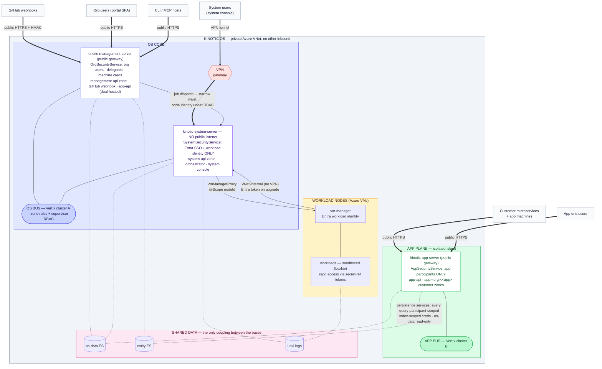

# Server Plane Architecture — Decision Record

Status: **accepted** (design session, 2026-08-09). Nothing here is implemented yet; this
records the decisions and the pre-work the implementation must respect.

## Context

Today one deployable, `kinotic-server`, serves every participant type — application
end-users, organization users, system operators, and machines — with one
`SecurityService`, one event bus, and zone rules (`ZoneRules`) as the sole partition.
Three pressures forced this decision:

- **Trust gradient.** The app surface terminates arbitrary customer code and end-user
  traffic; the org surface serves authenticated org members; the system surface controls
  workload orchestration on our VMs. One binary means one blast radius.
- **System-plane buildout.** PR #319 (merged) split the frontend into `apps/portal` and
  `apps/system`; system users are moving to Entra SSO; SYSTEM machines (vm-manager) need
  a provisioning story that does not distribute secrets — today (#396) vm-manager
  authenticates with machine client-credentials as an interim.
- **Job pipeline.** GitHub events must trigger grind jobs that start workloads via
  vm-manager, and org/MCP users must be able to re-run them.

A full service-to-plane inventory (every `@Publish`ed service, REST route, and
client→service edge in the codebase) was produced before deciding; its findings are
folded in below.

## Decisions

### 1. Three deployables, under one name

**Kinotic OS** is the entire system described here — the brand's "Operating System for
the Cloud" names the umbrella, so no single deployable claims the `os` name. Servers are
named for what they are: the management plane (where the platform is operated), the
system plane (the privileged core), and the application plane. Names that describe the
OS as a whole keep their `os` prefix (`os-data` — the OS's own state).

- **`kinotic-management-server`** — the management plane (today's `kinotic-server`
  module, renamed). Public gateway where the platform is operated. Assembles: core,
  domain, gateway, management-api, persistence, github. Serves: portal SPA, CLI (device-grant
  delegates), MCP hosts, GitHub webhooks — all ORGANIZATION-scope participants.
- **`kinotic-system-server`** — the system plane. Gateway reachable from the internet only
  over VPN; reachable directly inside the Azure VNet. Assembles: core, domain, gateway,
  system-api, system services. Serves: `apps/system` SPA, system users, vm-manager
  nodes.
- **`kinotic-app-server`** — the application plane. Public gateway. Assembles: core,
  domain, gateway, persistence (app-api services). Serves: application end-users,
  APPLICATION machines, customer microservices (which publish into `app.<org>.<app>`
  zones).

Assembly is the isolation mechanism: a plane's excluded modules are *absent from the
binary*, not disabled by configuration. No `@Profile`-gated or property-gated security
beans — each deployable wires its own.

### 2. Two buses, split along the trust gradient

- **OS bus** (one Vert.x cluster): `kinotic-management-server` + `kinotic-system-server` +
  vm-manager nodes — together the **OS core**. Org-and-system traffic shares this bus,
  so the github → grind → workload chain is ordinary in-cluster invocation — no bridge,
  no polling.
- **App bus** (its own cluster): `kinotic-app-server` alone, hosting `app-api` and the
  customer `app.<org>.<app>` zones.
- The buses are Vert.x event-bus clusters; the cluster manager (Ignite today) is an
  implementation detail behind them and stays swappable.
- **No bus link between the two clusters — ever.** Everything that crosses is state, and
  it flows through the shared data stores (§9).

### 3. One `SecurityService` per plane, selected by assembly

- `KinoticSecurityService` is renamed `OrgSecurityService` — it was always the security
  service for org participants, and the rename puts the three siblings in one shape —
  and moves out of kinotic-domain's blanket component scan into the `kinotic-management-server`
  deployable (resolving its standing FIXME). It keeps: org session cookie,
  email/password headers, machine client-credentials, Kinotic JWTs.
- `SystemSecurityService` (new, system plane): Entra SSO sessions for system users and
  Entra workload-identity Bearer tokens for machines. It contains **no** password path,
  no client-secret path, and no Kinotic-JWT path.
- `AppSecurityService` (new, app plane): application participants only — app OIDC/local
  login and APPLICATION machine client-credentials. Org and system participants cannot
  authenticate here.

### 4. SYSTEM machines authenticate with Entra workload identity — no secrets

The C/D/E provisioning question closes as **E-direct**: the VM's managed-identity token
(minted by IMDS, `aud` = the kinotic app registration) is presented as the Bearer
credential on every (re)connect and validated by `SystemSecurityService` against the
same tenant trust used for system-user SSO. Consequences:

- A SYSTEM machine's `MachineParticipantIdentity` row carries the Entra principal's
  `oid` (the `(oidcSubject, oidcConfigId)` shape users already have) and **no
  `IdentityCredential`**. `AuthType` gains this dichotomy for machines; the
  `beforeSave` pin to `CLIENT_CREDENTIALS` relaxes accordingly.
- Registration is **explicit**: a system operator registers the managed identity's `oid`
  through the system console. Trust-on-first-use via Entra app-role assignment was
  rejected — it would move the machine-registry authority out of kinotic.
- The kinotic-side `enabled` flag remains a kill switch independent of Entra.
- APPLICATION machines keep client credentials (org customers have no access to our
  tenant), as does any non-Azure deployment of vm-manager.

### 5. `app-api` is dual-hosted

kinotic-persistence's three app-api services (`JsonEntitiesRepository`,
`AdminJsonEntitiesRepository`, `NamedQueriesService`) are assembled on **both**
`kinotic-app-server` and `kinotic-management-server`. They are stateless over the shared entity ES,
so the portal's entity browsing is served locally on the OS bus while app clients
are served on the app bus. With separate buses this is required, not optional.

### 6. GitHub module stays on the management plane; workers get tokens, never services

Of the GitHub module's responsibilities (merged into kinotic-management-api behind the
`kinotic.disableGithub` gate), four pin to the management plane without tension: the
webhook handler (GitHub must reach it from the internet; the system gateway is VPN'd),
the install flow, the repo provisioner, and installation/repo state writes.

The cross-cutting fifth — repo credentials for workloads — is handled at **dispatch
time**: when the management plane dispatches a job, it mints the short-lived GitHub
installation token and passes it by **secret reference** (`SecretStorageService` /
`SecretReferenceResolver`), which the vm node resolves at execution. Workers never call
GitHub services; the credential is the entire interface. If a job class ever outlives
the ~1h token TTL, the planned evolution is extracting a `github-core` token library
into the system-server assembly (it can read installation rows from shared os-data ES) — not a
cross-plane call path.

`GitHubProjectRepoService` stays unpublished.

### 7. Job pipeline and the narrow waist

```text
GitHub → webhook handler (management plane) → JobDispatchService → grind engine
       → WorkloadOrchestrationService → VmManagerProxy(@Scope nodeId) → vm-manager → workload
```

All hops are on the OS bus. Although the shared bus makes the orchestration
services directly reachable, the webhook and re-run paths go **only** through
`JobDispatchService` — a deliberately narrow contract (roughly
`dispatch(trigger, projectId, secretRefs) → jobRunId`, `watch(jobRunId) → stream`).
The management plane reports that a job is warranted; the system plane owns what a job *is*.
This narrow waist is also the exit hatch: if the planes ever need physical separation
(§ Alternatives), it is already the bridge contract.

User-facing re-runs enter through a small management-api-zone service that verifies the caller's
org owns the `JobRun` (read from shared ES) before forwarding. Live status streams over
the bus (`watch`); shared ES serves only cold reads (history pages, ownership checks).
Job dispatch does not ride the `GitHubProjectEventService` fan-out (which has zero
subscribers today) — it is the explicit dispatch call. Webhook dispatch remains at-most-once, matching today's
semantics; a durable dispatch-outbox in ES is the designated upgrade if a lost event
ever costs something.

### 8. Supervisor RBAC, and narrowing machine authority

Declarative access control is added at the `ServiceInvocationSupervisor` — the one place
that already resolves the calling `Participant` for injection:

- `@Publish`ed interfaces declare their required participant type/roles once, replacing
  the hand-written `requireParticipant`/`requireUserParticipant` scatter and covering
  the services the inventory found guarded by zone alone (`MigrationService`,
  `AdminJsonEntitiesRepository`, both orchestration services, `LogManager`,
  `KinoticClusterInfoService`).
- The long-empty `Participant.roles` field starts carrying data.
- **Machine participants lose blanket authority.** Today `ZoneRules` gives every
  `SystemParticipant` `sendAnyZone = true`; on a shared OS bus, a workload
  escaping its sandbox would inherit a connection that can invoke anything. Machines get
  role-narrowed grants instead — vm-manager may invoke `VmNodeOrchestrationService` and
  host its own scoped `VmManager`, nothing else.
- Server-initiated in-cluster calls get a defined **node identity** (today they carry no
  participant at all), which is what the webhook→dispatch path invokes with.

### 9. No org↔app connection; shared data stores are the only coupling

- Both sides mount **os-data ES**: the OS core reads/writes identities, OIDC
  configs, machine credentials, entity definitions, job runs; the app plane reads
  identities (login verification) and entity-definition/named-query metadata (the
  repositories need it to operate).
- Org plane and app plane both mount **entity ES** (portal browsing, migrations,
  insights vs. tenant data operations).
- The app plane's store access rides a **least-privilege ES principal from day one**: an
  index-scoped role granting read/write on entity indices and read-only on exactly the
  os-data indices it needs (identities, entity definitions, named queries). This needs
  only index-level RBAC and API keys — Elasticsearch's free Basic tier — with security
  enabled on the deployed clusters (the dev compose keeps it off). Index-scoped roles
  work within a single cluster — this does not wait for the cluster split; the split
  later adds physical separation on top.
- The planned os-data / entity-data ES cluster split must preserve the app plane's
  os-data **read** access — it is a two-cluster split that app-server mounts both of,
  not one-cluster-per-plane.
- Org participants' currently-granted (and provably unused) ability to address
  `app.<org>.*` zones is severed. If a real org→app use case appears (support tooling),
  the decision then is a machine-bridge vs. relaxing `AppSecurityService` — neither is
  built ahead of a consumer.

## Topology



**Defense in depth, layer by layer:**

1. **Network** — two public HTTPS gateways plus the VPN gate; the system gateway is VPN/VNet-only; the two buses are never linked.
2. **Authentication** — a dedicated `SecurityService` per plane; each speaks only its participant types.
3. **Authorization** — zone rules + supervisor RBAC; machine identities role-narrowed, one per node.
4. **Isolation** — workloads sandboxed; credentials reach them only as short-lived secret references.
5. **Data** — every access scoped System, Org, or App over shared clusters, with
   least-privilege storage principals underneath.

In OS terms: the system plane is kernel space — privileged, no public listener — and
applications run in user space on their own bus.

## Alternatives considered

- **Three buses (full physical separation).** Strongest isolation; rejected for its tax:
  a Java remote client as required plumbing, cross-plane contracts, and cross-process
  timing couplings — for a boundary (org↔system) where both sides are our own
  authenticated constituents. Kept as the designated evolution; the `JobDispatchService`
  narrow waist is its ready-made bridge contract, and a Java Kinotic client remains
  attractive independently as a customer-facing JVM SDK.
- **One bus for everything, RBAC only.** Cheapest; rejected because the app plane
  terminates arbitrary customer code, and a missed annotation there would be a privilege
  escalation into workload orchestration. The trust boundary belongs between "our code"
  and "their code".
- **ES-projection return path for job status.** Rejected — it is a polling loop wearing
  a database. Live status streams over the bus; ES serves cold reads only.
- **Enrollment-style machine provisioning (bootstrap tokens, orchestrator-injected
  secrets).** Superseded by workload-identity federation (§4), which eliminates the
  secret lifecycle those options existed to manage.

## Accepted residual risks

- A compromised org-gateway node has OS-bus reach toward the system-api zone, bounded
  by supervisor RBAC, the narrow waist, and the VPN'd system gateway — not by the
  network. Accepted because the org surface is authenticated and far narrower than the
  app surface.
- Even index-scoped, `kinotic-app-server`'s ES principal spans every org's entity
  indices — per-org isolation inside entity ES is enforced by the persistence services'
  participant scoping, not by the store. Accepted as the standard multi-tenant
  data-plane shape; the per-org/app index layout keeps a per-tenant-credential
  evolution open if it is ever warranted.
- The vm-manager heartbeat interval (node-side) and heartbeat timeout (server-side)
  become a cross-process timing contract; a config mismatch silently marks healthy nodes
  OFFLINE and fails their workloads.

## Pre-work: defects the inventory surfaced

These predate the split and should be fixed (or verified) before or alongside it:

1. **Dangling TS proxies.** `IVmNodeService`/`IWorkloadService` target Java classes that
   do not exist; `IOrganizationService` targets an unpublished service; `LogManager` TS
   says management-api while Java says system-api; `LogService` is not wired into `ManagementApiPlugin`.
   Delete or repair.
2. **`DefaultLogService` → orchestrator `WorkloadService.findById`** is the single
   in-process cross-plane edge in the codebase (authorization read of
   `workload.organizationId`). Replace with a read of the workload row from shared ES;
   this also lets management-api drop its build dependency on kinotic-system-api.
3. **Zone-only-guarded services** (no in-method participant check):
   `MigrationService`, `AdminJsonEntitiesRepository`, `WorkloadOrchestrationService`,
   `VmNodeOrchestrationService`, `LogManager`, `KinoticClusterInfoService` — their
   access control today is the zone rules alone.
4. **`ITestService` ships in kinotic-server's main sources** on the management-api zone. Confirm
   its gating, or move it out of main.

## Open items

- `JobDispatchService` contract details (trigger shape, watch semantics, error model).
- System-console UX for machine registration (oid entry vs. Entra Graph pick-list).
- Sequencing against the ES cluster split (os-data / entity-data).
- Whether the system-user SSO config and the machine-federation trust are one
  `OidcConfiguration` row or two rows sharing the new unscoped type.
