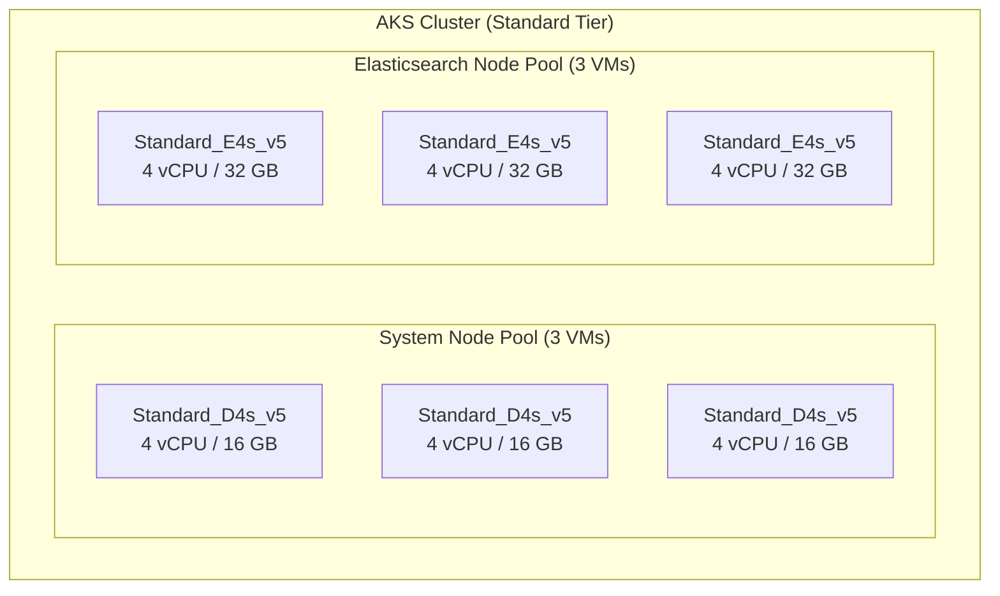
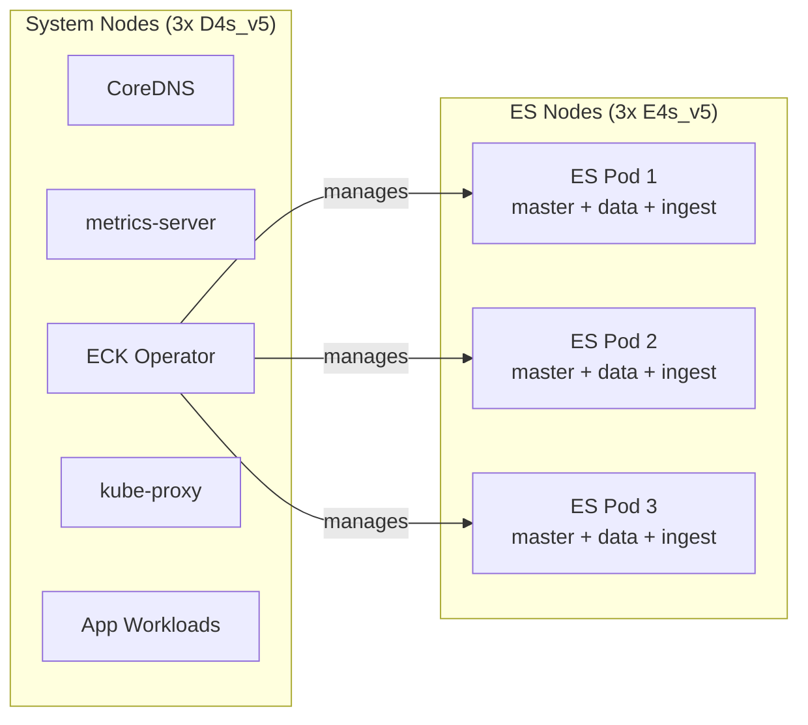
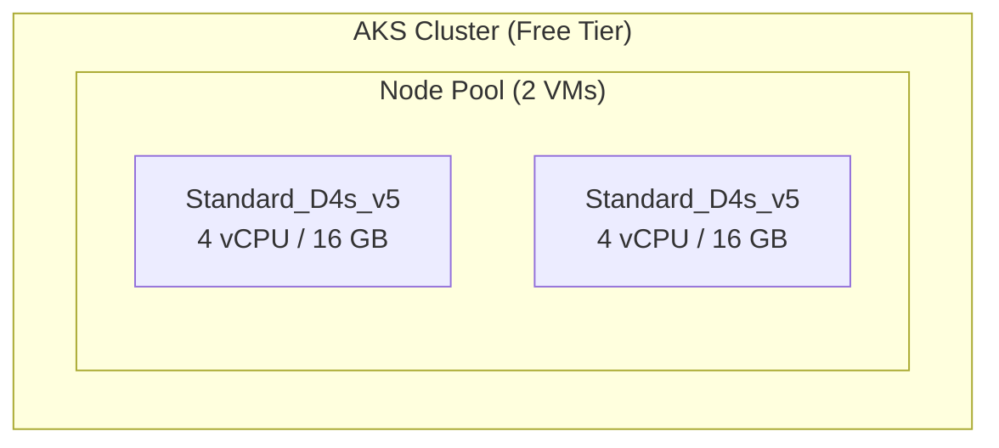

# AKS + Elasticsearch via ECK Operator

This document covers the minimum viable Azure Kubernetes Service (AKS) environments for running Elasticsearch using the [Elastic Cloud on Kubernetes (ECK)](https://www.elastic.co/guide/en/cloud-on-k8s/current/index.html) operator. Two environments are defined:

- **Production** -- smallest resilient deployment with HA guarantees
- **Dev/Staging** -- shared team environment, cost-optimized, no HA

> **Note:** All environments (including local KinD) use the same reusable Helm chart at `deployment/helm/elasticsearch/` which deploys an ECK `Elasticsearch` CRD. Environment-specific overrides are applied via separate values files (e.g. `deployment/kind/config/elasticsearch/values.yaml` for KinD).

---

## Table of Contents

- [ECK Operator Installation](#eck-operator-installation)
- [Production Environment](#production-environment)
- [Dev/Staging Environment](#devstaging-environment)
- [Cost Comparison](#cost-comparison)

---

## ECK Operator Installation

The ECK operator manages the full lifecycle of Elasticsearch clusters on Kubernetes (provisioning, scaling, upgrades, TLS). Install it once per cluster; both production and dev environments use the same process.

### Install via Helm

```bash
# Add the Elastic Helm repository
helm repo add elastic https://helm.elastic.co
helm repo update

# Install the ECK operator into the elastic-system namespace
helm install elastic-operator elastic/eck-operator \
  --namespace elastic-system \
  --create-namespace
```

### Verify the operator is running

```bash
kubectl -n elastic-system get pods
```

Expected output:

```
NAME                 READY   STATUS    RESTARTS   AGE
elastic-operator-0   1/1     Running   0          1m
```

### Operator resource footprint

The ECK operator itself is lightweight:

| Resource | Typical Usage |
|----------|---------------|
| CPU      | ~100m idle, spikes during reconciliation |
| Memory   | ~200 MB |
| Pods     | 1 (StatefulSet) |

It runs on the system node pool alongside other cluster infrastructure.

---

## Production Environment

### Architecture Overview



### AKS Cluster Configuration

| Setting | Value |
|---------|-------|
| Tier | Standard (99.9%-99.95% uptime SLA) |
| Control plane cost | Free (Azure does not charge for the AKS control plane) |
| Kubernetes version | Latest stable (1.29+) |
| Total VMs | **6** |

### System Node Pool

Runs CoreDNS, metrics-server, kube-proxy, the ECK operator, and application workloads.

| Property | Value |
|----------|-------|
| VM count | **3** (minimum for production HA) |
| VM size | Standard_D4s_v5 |
| Specs per VM | 4 vCPU, 16 GB RAM |
| Taint | `CriticalAddonsOnly=true:NoSchedule` |
| Availability zones | Spread across zones 1, 2, 3 |
| Est. cost | ~$140/mo each = **~$420/mo** |

**Why 3 nodes:**

- Survives a single node failure with ~67% capacity remaining
- Ensures system pod availability during upgrades and maintenance
- Microsoft's explicit production recommendation

### Elasticsearch Node Pool

Dedicated pool for Elasticsearch pods. ECK's default pod anti-affinity places one ES pod per Kubernetes node, so the node count must equal the ES replica count.

| Property | Value |
|----------|-------|
| VM count | **3** (one per ES pod) |
| VM size | Standard_E4s_v5 (memory-optimized) |
| Specs per VM | 4 vCPU, 32 GB RAM |
| Taint | `elasticsearch=true:NoSchedule` |
| Availability zones | Spread across zones 1, 2, 3 |
| Est. cost | ~$210/mo each = **~$630/mo** |

**Why E-series (memory-optimized):**

- Elasticsearch is memory-bound; the JVM heap is auto-sized from the container memory limit (since ES 7.11)
- 32 GB RAM per node gives ~16 GB heap + ~16 GB for OS page cache (critical for Lucene segment performance)
- D-series (16 GB) leaves only ~8 GB heap + ~8 GB cache, which is tight for production workloads

### Storage

Each Elasticsearch node needs a persistent volume:

| Property | Value |
|----------|-------|
| Type | Azure Premium SSD via `managed-csi-premium` StorageClass |
| Size per node | 128 GB (scale up based on data volume) |
| Est. cost | ~$19/mo per 128 GB P10 disk x 3 = **~$57/mo** |

### Elasticsearch Topology

Three combined-role nodes (master + data + ingest):

- 3 master-eligible nodes provide quorum (tolerates loss of 1 node)
- 1 primary + 1 replica shard per index for data redundancy
- This is Elastic's recommended minimum for a resilient small cluster

### Pod Placement



### Sample Elasticsearch CRD (Production)

```yaml
apiVersion: elasticsearch.k8s.elastic.co/v1
kind: Elasticsearch
metadata:
  name: structures-es
  namespace: default
spec:
  version: 8.18.1
  nodeSets:
    - name: default
      count: 3
      config:
        node.roles: ["master", "data", "ingest"]
        # Auto-sized from container memory limit (ES 7.11+)
        # xpack.security is enabled by default; ECK manages TLS certificates automatically
      podTemplate:
        spec:
          containers:
            - name: elasticsearch
              resources:
                requests:
                  memory: 16Gi
                  cpu: "2"
                limits:
                  memory: 16Gi
                  cpu: "4"
          nodeSelector:
            agentpool: elasticsearch
          tolerations:
            - key: elasticsearch
              operator: Equal
              value: "true"
              effect: NoSchedule
          affinity:
            podAntiAffinity:
              requiredDuringSchedulingIgnoredDuringExecution:
                - labelSelector:
                    matchLabels:
                      elasticsearch.k8s.elastic.co/cluster-name: structures-es
                  topologyKey: kubernetes.io/hostname
      volumeClaimTemplates:
        - metadata:
            name: elasticsearch-data
          spec:
            accessModes: ["ReadWriteOnce"]
            storageClassName: managed-csi-premium
            resources:
              requests:
                storage: 128Gi
```

### Production Cost Summary

| Component | Monthly Cost (Pay-as-you-go, East US) |
|-----------|---------------------------------------|
| System pool (3x D4s_v5) | ~$420 |
| ES pool (3x E4s_v5) | ~$630 |
| Storage (3x 128 GB Premium SSD) | ~$57 |
| AKS control plane | $0 |
| **Total** | **~$1,107/mo** |

**Cost reduction options:**

| Strategy | Savings | Estimated Total |
|----------|---------|-----------------|
| 1-year reserved instances | ~35-40% | ~$670/mo |
| 3-year reserved instances | ~55-60% | ~$470/mo |

### Budget-Constrained Alternative (3 VMs)

If cost is the overriding concern, collapse to a single node pool:

- **3x Standard_E4s_v5** (4 vCPU, 32 GB) running both system pods and ES pods
- Total VMs: **3**
- Est. cost: ~$630/mo + storage

**Trade-offs:**

- No workload isolation -- a memory-hungry ES pod can starve system pods
- Cannot scale ES and system infrastructure independently
- Not a Microsoft-recommended pattern for production
- Less headroom for the ECK operator, monitoring, and ingress controllers

---

## Dev/Staging Environment

A shared development or staging environment for a small team. Prioritizes low cost while still using the ECK operator for consistency with production.

### Architecture Overview



### AKS Cluster Configuration

| Setting | Value |
|---------|-------|
| Tier | Free (no SLA, acceptable for dev) |
| Control plane cost | Free |
| Kubernetes version | Latest stable (match production) |
| Total VMs | **2** |

### Single Node Pool

Runs everything: system pods, the ECK operator, Elasticsearch, and application workloads.

| Property | Value |
|----------|-------|
| VM count | **2** |
| VM size | Standard_D4s_v5 |
| Specs per VM | 4 vCPU, 16 GB RAM |
| Taints | None (all workloads share the pool) |
| Availability zones | Not required for dev |
| Est. cost | ~$140/mo each = **~$280/mo** |

**Why 2 nodes:**

- Provides enough headroom for ES + system pods + app workloads
- Allows Kubernetes to reschedule pods if one node has issues
- Single node works but leaves zero margin during node maintenance

### Storage

| Property | Value |
|----------|-------|
| Type | Azure Standard SSD via `managed-csi` StorageClass |
| Size per node | 32 GB |
| Est. cost | ~$3/mo per 32 GB E4 disk = **~$3/mo** |

### Sample Elasticsearch CRD (Dev/Staging)

```yaml
apiVersion: elasticsearch.k8s.elastic.co/v1
kind: Elasticsearch
metadata:
  name: structures-es
  namespace: default
spec:
  version: 8.18.1
  nodeSets:
    - name: default
      count: 1
      config:
        node.roles: ["master", "data", "ingest"]
      podTemplate:
        spec:
          containers:
            - name: elasticsearch
              resources:
                requests:
                  memory: 4Gi
                  cpu: "500m"
                limits:
                  memory: 4Gi
                  cpu: "2"
          affinity:
            podAntiAffinity:
              preferredDuringSchedulingIgnoredDuringExecution:
                - weight: 100
                  podAffinityTerm:
                    labelSelector:
                      matchLabels:
                        elasticsearch.k8s.elastic.co/cluster-name: structures-es
                    topologyKey: kubernetes.io/hostname
      volumeClaimTemplates:
        - metadata:
            name: elasticsearch-data
          spec:
            accessModes: ["ReadWriteOnce"]
            storageClassName: managed-csi
            resources:
              requests:
                storage: 32Gi
```

**Key differences from production:**

- `count: 1` -- single node, no HA (acceptable for dev)
- 4 GB memory limit (gives ~2 GB JVM heap)
- `preferredDuringScheduling` anti-affinity so ES can colocate with other pods on the same node
- Standard SSD instead of Premium SSD
- No `nodeSelector` or `tolerations` (shared pool)

### Scaling Up for Replica Testing

To test index replication behavior, increase the node count to 2:

```yaml
nodeSets:
  - name: default
    count: 2
    # ... rest unchanged
```

This allows Elasticsearch to allocate replica shards to a second node, matching production replication behavior.

### Dev/Staging Cost Summary

| Component | Monthly Cost (Pay-as-you-go, East US) |
|-----------|---------------------------------------|
| Node pool (2x D4s_v5) | ~$280 |
| Storage (1x 32 GB Standard SSD) | ~$3 |
| AKS control plane | $0 |
| **Total** | **~$283/mo** |

---

## Cost Comparison

| | Dev/Staging | Production | Production (1yr RI) |
|-|-------------|------------|---------------------|
| VMs | 2 | 6 | 6 |
| ES nodes | 1 | 3 | 3 |
| HA | No | Yes (3-zone) | Yes (3-zone) |
| SLA | None | 99.9%+ | 99.9%+ |
| Monthly cost | **~$283** | **~$1,107** | **~$670** |

---

## Accessing Elasticsearch

ECK automatically configures TLS and creates a `Secret` with the default `elastic` user credentials.

### Get the password

```bash
kubectl get secret structures-es-es-elastic-user \
  -o go-template='{{.data.elastic | base64decode}}'
```

### Port-forward for local access

```bash
kubectl port-forward svc/structures-es-es-http 9200:9200
```

### Test connectivity

```bash
curl -k -u "elastic:$(kubectl get secret structures-es-es-elastic-user \
  -o go-template='{{.data.elastic | base64decode}}')" \
  https://localhost:9200
```

### Internal cluster access

Other pods in the cluster can reach Elasticsearch at:

```
https://structures-es-es-http.default.svc:9200
```

The ECK operator provisions a self-signed CA and per-node certificates automatically. Application pods that need to trust the CA can mount the CA secret:

```yaml
volumes:
  - name: es-certs
    secret:
      secretName: structures-es-es-http-certs-public
```
